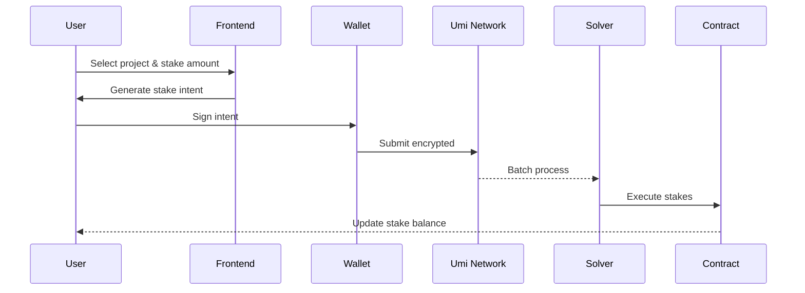
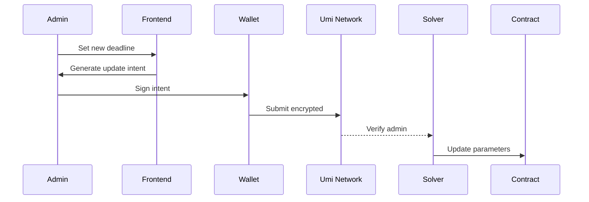

```mermaid
sequenceDiagram
    User->>Frontend: Select project & stake amount
    Frontend->>User: Generate stake intent
    User->>Wallet: Sign intent
    Wallet->>Umi Network: Submit encrypted
    Umi Network-->>Solver: Batch process
    Solver->>Contract: Execute stakes
    Contract-->>User: Update stake balance
```

```mermaid
sequenceDiagram
    Admin->>Frontend: Set new deadline
    Frontend->>Admin: Generate update intent
    Admin->>Wallet: Sign intent
    Wallet->>Umi Network: Submit encrypted
    Umi Network-->>Solver: Verify admin
    Solver->>Contract: Update parameters
```

<!-- open with cmd+shift+v -->